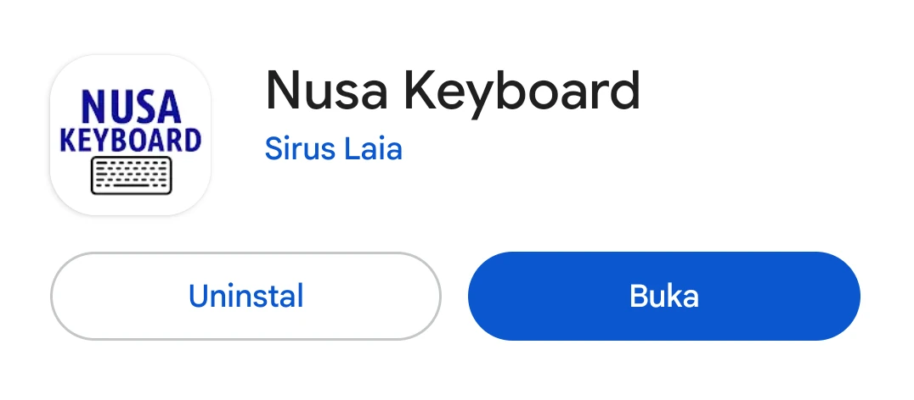
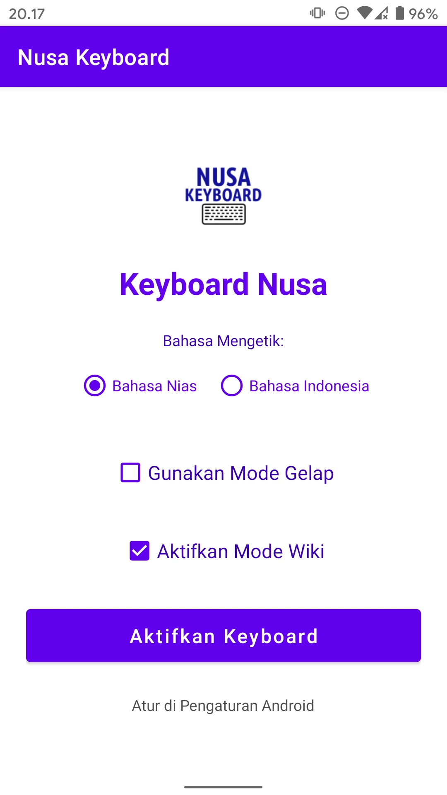
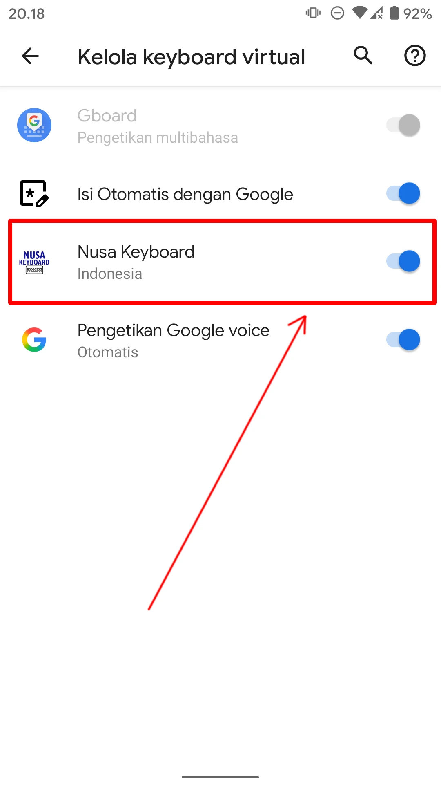
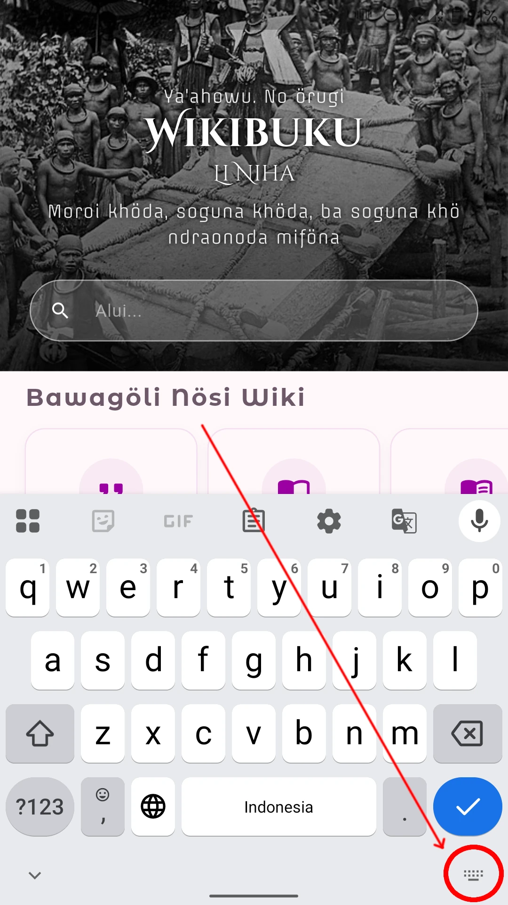
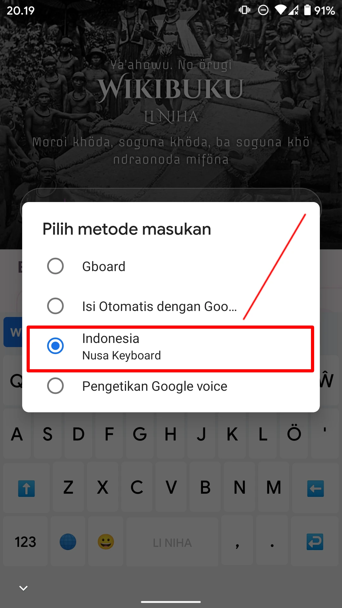
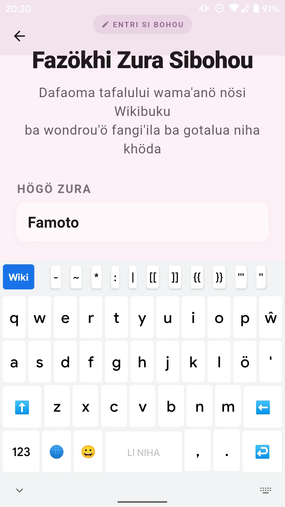

# PANDUAN APLIKASI NUSA KEYBOARD

## INTRO

Anda ingin mengetik dalam bahasa Nias? Dengan aplikasi Nusa Keyboard bisa! **Huruf ö dan ŵ telah tersedia**. Anda bisa menukar papan ketik antara **bahasa Nias dan bahasa Indonesia**.

Selain itu papan ketik ini memiliki **tombol untuk mengaktifkan code wiki**. Jadi merupakan peralatan penting buat mereka yang sering menulis di Wikipedia, Wikikamus dan Wikibuku Nias.

## MENGINSTAL DAN MENGATUR APLIKASI NUSA KEYBOARD

1. Klik di  untuk pergi ke Play Store

2. Pastikan Anda melihat aplikasi Nusa Keyboard. Klik pada tombol "Instal". Tunggu sampai selesai dan Anda melihat tombol biru "Buka" 

3. Anda bisa langsung menjalankan aplikasi dari sini dengan mengetuk tombol BUKA atau Anda pergi ke laci aplikasi dan mengetuk ikon Nusa Keyboard di sana.

4. Anda melihat Pengaturan papan ketik. Klik di tombol AKTIFKAN KEYBOARD

5. Anda melihat berbagai papan ketik yang telah terinstal di smartphone Anda. Aktifkan Nusa Keyboard. 

6. Selesai. Anda bisa menggunakan Nusa Keyboard untuk mengetik.

## MENGGUNAKAN PAPAN KETIK NUSA KEYBOARD

1. Jalankan aplikasi seperti WikiNusa.

2. Klik di tempat pencarian, yang otomatis menampilkan papan ketik *default* yang ada.

3. Klik di Nusa Keyboard untuk memilih papan ketik Nusa Keyboard

4. Anda siap mengetik dalam bahasa Nias.

5. Klik di ikon globe untuk bergonta-ganti layout papan ketik antara bahasa Nias dan bahasa Indonesia
